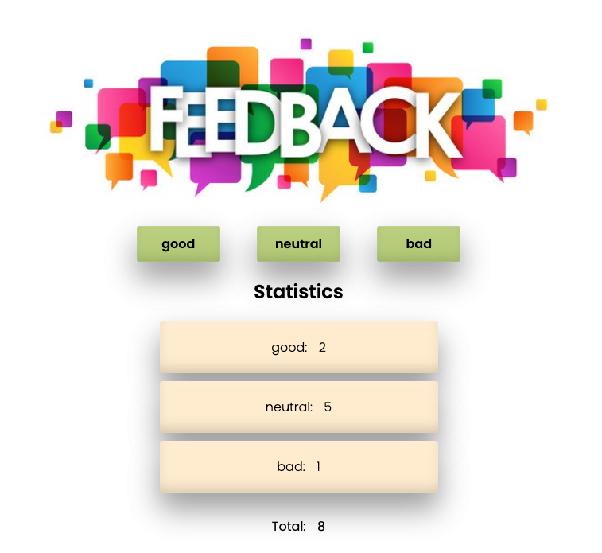

### A feedback widget

 

# Критерии приема

- При сдаче домашней работы есть ссылки: на исходные файлы и рабочую страницу
  проектов на `GitHub Pages`.
- При запуске кода задания, в консоли нету ошибок и предупреждений.
- Для каждого компонента есть отдельная папка с файлом React-компонента и файлом
  стилей.
- Имена компонентов понятные, описательные.

## Виджет отзывов

- Создан репозиторий `goit-react-hw-04-hooks-feedback`.
- Проведи рефакторинг кода задания `Виджет отзывов` используя React-хуки.
